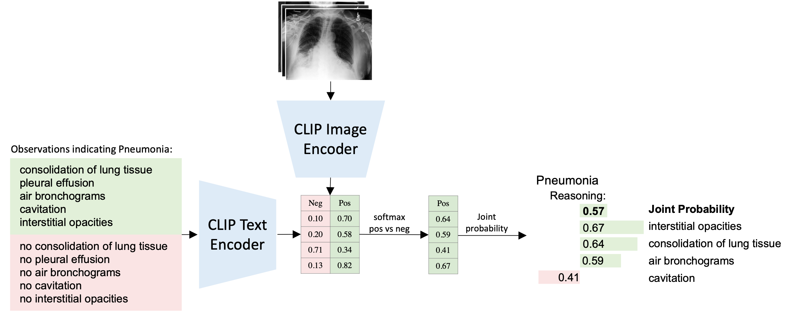

# Xplainer: From X-Ray Observations to Explainable Zero-Shot Diagnosis
**Online Demo:** [](https://huggingface.co/spaces/CAMP-ViL/Xplainer)
**Paper**: [](https://link.springer.com/chapter/10.1007/978-3-031-43904-9_41) [](https://arxiv.org/pdf/2303.13391.pdf)


This is the official repository for the paper "Xplainer: From X-Ray Observations to Explainable Zero-Shot Diagnosis", which was accepted for publication at MICCAI 2023.



We propose a new way of explainability for zero-shot diagnosis prediction in the clinical domain. Instead of directly predicting a diagnosis, we prompt the model to classify the existence of descriptive observations, which a radiologist would look for on an X-Ray scan, and use the descriptor probabilities to estimate the likelihood of a diagnosis, making our model explainable by design. For this we leverage BioVil, a pretrained CLIP model for X-rays and apply contrastive observation-based prompting. We evaluate Xplainer on two chest X-ray
datasets, CheXpert and ChestX-ray14, and demonstrate its effectiveness
in improving the performance and explainability of zero-shot diagnosis.
**Authors**: [Chantal Pellegrini][cp], [Matthias Keicher][mk], [Ege Özsoy][eo], [Petra Jiraskova][pj], [Rickmer Braren][rb], [Nassir Navab][nn]

[cp]:https://www.cs.cit.tum.de/camp/members/chantal-pellegrini/
[eo]:https://www.cs.cit.tum.de/camp/members/ege-oezsoy/
[mk]:https://www.cs.cit.tum.de/camp/members/matthias-keicher/
[pj]:https://campus.tum.de/tumonline/ee/ui/ca2/app/desktop/#/pl/ui/$ctx/visitenkarte.show_vcard?$ctx=design=ca2;header=max;lang=de&pPersonenGruppe=3&pPersonenId=46F3A857F258DEE6
[rb]:https://radiologie.mri.tum.de/de/person/prof-dr-rickmer-f-braren
[nn]:https://www.cs.cit.tum.de/camp/members/cv-nassir-navab/nassir-navab/

```
@article{pellegrini2023xplainer,
  title={Xplainer: From X-Ray Observations to Explainable Zero-Shot Diagnosis},
  author={Pellegrini, Chantal and Keicher, Matthias and {\"O}zsoy, Ege and Jiraskova, Petra and Braren, Rickmer and Navab, Nassir},
  journal={arXiv preprint arXiv:2303.13391},
  year={2023}
}
```

### Setup:
1. Clone this repository
   ```
   git clone https://github.com/ChantalMP/Xplainer
   ```
2. Install requirements:
   
   - use Python 3.7
   - install requirements:
   ```
   conda create -n xplainer_env python=3.7
   conda activate xplainer_env
   pip install hi-ml-multimodal==0.1.2
   pip install -r requirements.txt
   ```
   
3. Download data
   
   CheXpert:
   - download data from https://stanfordaimi.azurewebsites.net/datasets/23c56a0d-15de-405b-87c8-99c30138950c
   - copy 'test_labels.csv' and the image folder 'test' into 'data/chexpert'
  
   ChestXRay14:
   - download data from 'https://nihcc.app.box.com/v/ChestXray-NIHCC/folder/36938765345'
   - use the script 'preprocess_chestxray14' to download the data
   - copy 'images', 'test_list.txt' and 'Data_Entry_2017_v2020.csv' into 'data/chestxray14'
   - run
     ```
      python -m preprocesss_chestxray14
     ```

### Reproduce our results:
run
```
python -m inference --dataset chexpert
```
or
```
python -m inference --dataset chestxray14
```

### Run demo locally:
run
```
python -m demo
```

### Intended Use
This model is intended to be used solely for (I) future research on visual-language processing and (II) reproducibility of the experimental results reported in the reference paper.
